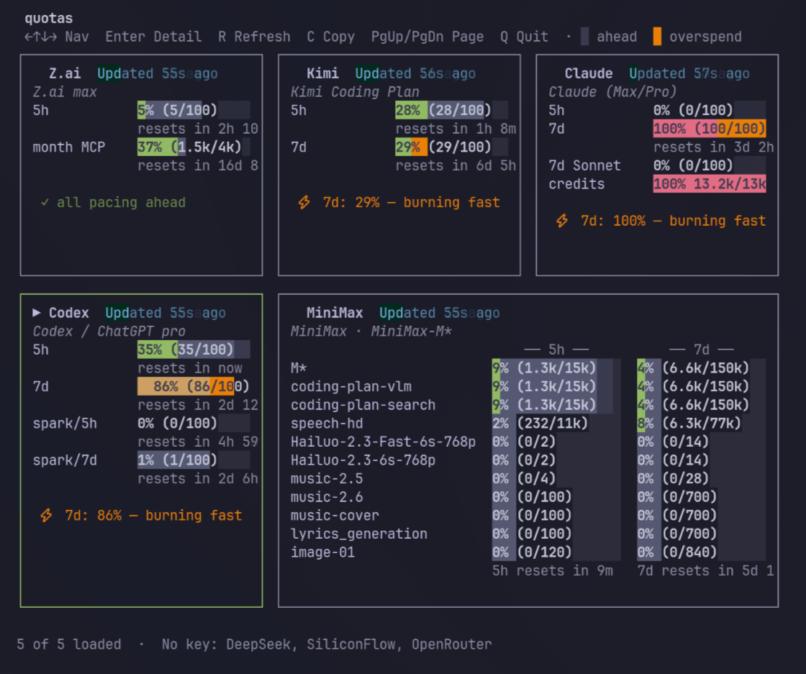

# quotas

A Rust CLI that auto-detects your AI provider credentials and shows usage
quotas for each provider in a single place — either as an interactive TUI,
a compact statusline for shell prompts, or filterable JSON.



## Providers

| Provider | Auth discovery | Endpoint |
|----------|----------------|----------|
| **Claude** (Max/Pro subscription or API key) | `$CLAUDE_CONFIG_DIR/.credentials.json` → `~/.claude/.credentials.json` → `ANTHROPIC_API_KEY` | `GET /api/oauth/usage` on `api.anthropic.com` |
| **Codex** / ChatGPT subscription | `~/.codex/auth.json` → `OPENAI_API_KEY` | `GET /backend-api/wham/usage` on `chatgpt.com` |
| **MiniMax** Token Plan | `MINIMAX_API_KEY` → `~/.minimax` | `GET /v1/api/openplatform/coding_plan/remains` on `api.minimax.io` |
| **Gemini** (Google AI Studio) | `GOOGLE_API_KEY` → ADC credentials | `POST /v1internal:retrieveUserQuota` on `cloudcode-pa.googleapis.com` |
| **Kimi** (Coding Plan + PAYG) | `MOONSHOT_API_KEY` / `KIMI_API_KEY` | `GET /coding/v1/usages` and `/v1/users/me/balance` |
| **Z.ai / GLM** Coding Plan | `ZHIPU_API_KEY` / `ZAI_API_KEY` → `~/.api-zai` | `GET /api/monitor/usage/quota/limit` on `api.z.ai` |
| **DeepSeek** | `DEEPSEEK_API_KEY` → `~/.deepseek` | `GET /user/balance` on `api.deepseek.com` |
| **SiliconFlow** | `SILICONFLOW_API_KEY` → `~/.siliconflow` | `GET /v1/user/info` on `api.siliconflow.cn` |
| **OpenRouter** | `OPENROUTER_API_KEY` → `~/.openrouter` | `GET /api/v1/credits` on `openrouter.ai` |
| **GitHub Copilot** | opencode `github-copilot` slot → `GITHUB_COPILOT_TOKEN` → `[github_copilot].token` in config | `GET /copilot_internal/user` on `api.github.com` |

## Install

```bash
cargo install quotas
```

## Usage

### Interactive TUI (default)

```bash
quotas
```

Keybinds: `←↑↓→` navigate providers, `Enter` drill into a card, `R` refresh,
`A` toggle auto-refresh, `F` favorite the selected provider on the dashboard,
`C` copy selected provider's JSON to clipboard, `Q` quit.

Inside detail view: `Tab` cycles `auto/normal/compact` detail layout,
`↑` / `↓` move the quota focus, `PgUp` / `PgDn` scroll, `F` favorites the
focused quota, and `X` hides or unhides the focused quota row.

TUI refresh settings live in `~/.config/quotas/config.toml`:

```toml
[tui]
auto_refresh = true       # periodic quota refresh while the TUI is open
refresh_on_start = true   # fetch after the TUI loads, even with fresh cache

[providers]
enabled = ["*"]    # wildcard = all providers; specific list = whitelist
disabled = []     # exclude from enabled set

[favorites]
providers = ["claude", "codex"]   # favorite providers sort first

[quota_preferences.codex]
favorites = ["5h", "spark/7d"]    # favorite quotas render first
hidden = ["o3/weekly"]            # hidden quotas stay collapsed in detail view
```

### JSON output

```bash
quotas --json                          # all providers
quotas --json --pretty                 # pretty-printed
quotas --json --provider=claude,codex  # filter by provider
quotas --version                       # print installed version
quotas --check-update                  # check crates.io for a newer release
```

### Statusline (shell prompt)

```bash
quotas --statusline                    #   claude 80/100 |   codex 60/100 | ...
quotas --statusline --no-icons         # claude 80/100 | codex 60/100 | ...
quotas --statusline --provider=claude  #   claude 80/100
quotas --statusline --format='%provider: %remaining/%limit (%window)'
```

Statusline reads from local caches (`$XDG_CACHE_HOME/quotas/cache.json` and
`$XDG_CACHE_HOME/quotas/update.json`), so it's instant with no foreground
network call. If the provider cache is older than 30 minutes, it forks a
background quota refresh automatically. If the update cache is older than 24
hours, it forks a background crates.io version check; pass `--no-update-check`
to disable that.

Shell integration examples:

```bash
# bash PS1
PS1='$(quotas --statusline)\n\$ '

# starship custom module
[custom.quotas]
command = "quotas --statusline"

# fish right prompt
function fish_right_prompt; quotas --statusline; end
```

## Output

Each provider result reports one of:

- **available** — authenticated and the usage API responded. Includes a
  plan name and one or more `QuotaWindow` entries (`5h`, `weekly`, etc.)
  with used/limit/remaining and reset timestamps. Claude subscription results
  also surface model-specific weekly windows reported by the API, such as
  `weekly_fable`.
- **auth_required** — no credentials were discoverable for that provider.
- **unavailable** — credentials worked but the server reported the plan
  is not active or the endpoint returned an error; includes a console URL.
- **network_error** — transport error reaching the endpoint.

## License

Dual-licensed under The Unlicense OR CC0-1.0.
